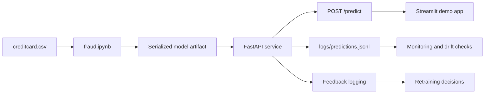

# Fraud Detection Demo

This project is a practical machine-learning application that shows how a fraud model can move from a Jupyter notebook to a real, testable service.

For a recruiter, hiring manager, or non-technical reviewer, the simplest way to understand it is this:

- it analyzes transaction data,
- tries to estimate how likely a payment is to be fraudulent,
- exposes that prediction through an API,
- lets a user test it in a simple dashboard,
- and keeps logs so performance can be monitored over time.

This is a strong example of end-to-end ML work: data preparation, model training, deployment, monitoring, and explainability.

## Problem statement

Online payment fraud is difficult to catch consistently because fraudulent transactions are rare, patterns change over time, and blocking a legitimate customer can be nearly as damaging as missing a fraudulent payment. A useful system must therefore rank transaction risk, support human review, and remain observable after deployment.

## How this project solves it

This project trains a classification model on historical transaction patterns and returns a fraud probability for each new transaction. A configurable threshold turns that probability into a review signal, while the FastAPI service, Streamlit dashboard, prediction logs, drift checks, and feature-importance report demonstrate how the model can be used and monitored as part of a broader workflow.

## Why this project matters

Fraud detection is a classic business problem because the cost of mistakes is high:

- a false positive may block a legitimate customer,
- a false negative may allow real fraud to slip through,
- and the dataset is often highly imbalanced, which makes ordinary accuracy misleading.

That is why this project focuses on:

- fraud probability, not just a label,
- business-friendly thresholding,
- monitoring for drift,
- and explainability for trust and review.

## What the project does

This repo contains a mini machine-learning workflow that:

1. loads transaction data from the credit card dataset,
2. trains a classification model,
3. saves the trained model as a reusable artifact,
4. serves predictions with FastAPI,
5. provides a Streamlit interface for manual and batch testing,
6. logs predictions and feedback for monitoring,
7. generates a drift report and feature importance view.

## Project architecture

The system is intentionally simple and modular:



- `fraud.ipynb` — training, evaluation, and artifact creation
- `creditcard.csv` — transactional data used for model development
- `fraud_detection_pipeline.pkl` — production-style model artifact
- `api/` — API layer that accepts transaction data and returns predictions
- `ui/` — Streamlit app for demoing the model
- `monitoring/` — drift detection and model health checks
- `scripts/` — utilities for baseline generation and explainability output
- `artifacts/` — generated reports and summary files
- `logs/` — prediction and feedback logs

## How it works in plain English

The project follows a common ML lifecycle:

- Train the model on historical transaction data.
- Save the model artifact so it can be reused outside the notebook.
- Create a service that accepts a transaction and returns a fraud probability.
- Make a threshold decision such as “flag if probability > 0.5”.
- Log prediction history so it can be checked later for drift or unexpected behavior.
- Use feature importance and monitoring reports to understand if the model is still acting normally.

## Tech stack

This project uses:

- Python
- Pandas and NumPy
- scikit-learn
- XGBoost
- FastAPI
- Streamlit
- JSONL logging
- basic monitoring and diagnostics

## Repo layout

- `README.md` — project overview and setup instructions
- `DEPLOYMENT.md` — operation and deployment runbook
- `MODEL_CARD.md` — model documentation and metrics summary
- `fraud.ipynb` — notebook used for training and experimentation
- `creditcard.csv` — dataset used in the project
- `api/main.py` — FastAPI application
- `api/model.py` — model loading and prediction logic
- `api/schemas.py` — request and response validation
- `ui/app.py` — user-facing dashboard
- `monitoring/drift.py` — drift detection logic
- `scripts/` — export and explainability helpers

## Quick start

### 1) Create and activate an environment

```bash
python -m venv .venv
source .venv/bin/activate
```

On Windows PowerShell:

```powershell
python -m venv .venv
.\.venv\Scripts\Activate.ps1
```

### 2) Install dependencies

```bash
pip install -r requirements.txt
```

### 3) Train the model

Open and run `fraud.ipynb` to generate the saved model artifact.

Typical outputs include:

- `fraud_detection_pipeline.pkl`
- `best_fraud_model.pkl`

### 4) Start the API

```bash
uvicorn api.main:app --host 127.0.0.1 --port 8000 --reload
```

Check the health endpoint:

```bash
curl http://127.0.0.1:8000/health
```

### 5) Run the Streamlit app

```bash
$env:API_URL="http://127.0.0.1:8000"
streamlit run ui/app.py
```

Then open the local URL shown in the terminal, usually http://localhost:8501.

## Example API behavior

The API accepts either a single transaction or a batch of transactions and returns a fraud probability.

Example response fields include:

- `fraud_probability`
- `is_fraud`
- `request_id`
- `threshold`

A real system would use these values for fraud review workflows, risk scoring, or automated actioning.

## Monitoring and explainability

This repo also includes:

- prediction logging in `logs/predictions.jsonl`
- feedback logging in `logs/feedback.jsonl`
- baseline generation for drift monitoring
- feature importance export for interpretability

These are useful because no model should be treated as static forever. In real usage, you monitor the model for drift, review false positives, and retrain when needed.

## Results and outputs

The notebook evaluation selected a tuned XGBoost classifier as the best-performing model in the experiments. At the tuned operating point, the reported results were approximately:

- ROC-AUC: `0.9758`
- Precision: `0.9518`
- Recall: `0.8061`
- F1-score: `0.8729`

The project produces more than a trained model. It includes:

- a serialized model artifact that can be loaded by the API,
- a FastAPI service for single and batch transaction scoring,
- a Streamlit dashboard for manual testing and plain-English risk interpretation,
- JSONL prediction and feedback logs,
- a baseline and drift report for monitoring,
- a feature-importance export for model inspection.

The default API threshold is `0.5`, while the notebook explored a threshold near `0.9742` for the best F1 trade-off. These values are starting points for review workflows, not universal production settings.

## Current limitations

This is a strong prototype, but it is not yet a production-grade fraud system.

In a real deployment you would still want to add:

- authentication and authorization,
- input validation and rate limiting,
- alerting and dashboards,
- retraining pipelines,
- database-backed storage,
- stronger governance and model review processes.

## Possible next steps

Potential extensions include:

- pin the model training environment to avoid version drift,
- fill the model card with final metrics and deployment notes,
- add a cloud or Docker deployment path,
- add richer analytics for false positives and review thresholds,
- add a project screenshot or demo GIF for GitHub presentation.
